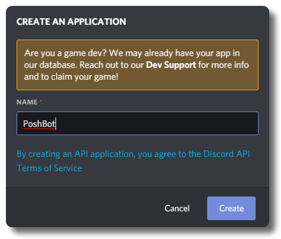
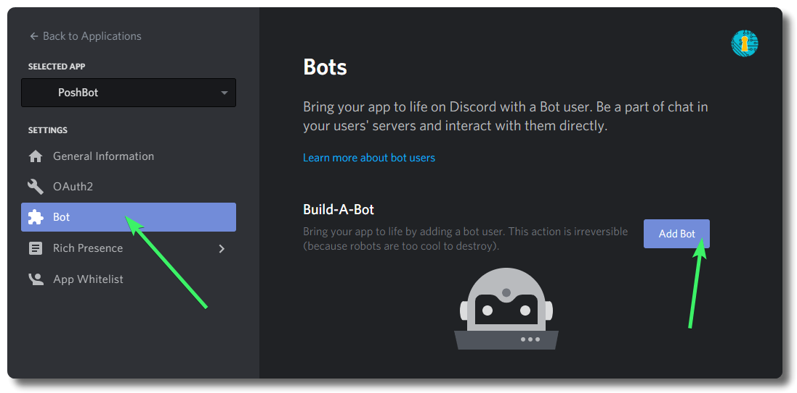

# Setting up the Discord Backend

The Discord backend works similar to Slack's; messages are received from Discord via WebSocket constantly monitoring the channels that the bot has been added to. Responses are sent back to Discord via REST API call. Listing channels and users are also handled via REST.

## Prerequisites

* A Discord account and your own Discord server
    * If you haven’t created one yet, go to [Discordapp.com](https://discordapp.com/) and create one.
    * If you do have one, log in to your account and open up the server in which you want your bot to live.

* [Setting up the Discord Backend](#setting-up-the-discord-backend)
    * [Prerequisites](#prerequisites)
    * [Create an Application on Discord](#create-an-application-on-discord)
    * [Authorize your Bot](#authorize-your-bot)
    * [Find your Guild ID (Server ID)](#find-your-guild-id-server-id)
    * [Create PoshBot Startup Script](#create-poshbot-startup-script)
    * [Start PoshBot](#start-poshbot)

## Create an Application on Discord

First, you will need to create an application on Discord. Open a text editor to copy some information down as you follow these steps:

1. Open [https://discordapp.com/developers/applications](https://discordapp.com/developers/applications/) to view the Applications section on the Discord Developer Portal
    * *Log in to your account if you need to*
2. Click the purple `New Application` button on the top-right of the page to create a new application:

   
3. Provide a memorable name for your bot when prompted, then click the purple `Create` button on the bottom-right:

   
4. You will be placed on the General Information page for your application. **Copy the `Client ID` listed on this page to your text editor for later**
5. On the left-hand menu, click the `Bot` section, then click the purple `Add Bot` button:

   
6. You will be placed on the Build-A-Bot page.

## Authorize your Bot

With your text editor still open, follow these steps:

On the Build-A-Bot page...

1. Set your Bot's username to something other than the application name, if desired. This is the username your Discord users will see.
2. Under `Token`, click the blue link to `Click to Reveal Token`. **Copy the `Token` listed and paste it on your text editor for later**
3. **Recommended:** Under `Public Bot`, click the purple toggle to disable making the bot publicly available. This will ensure that only you can join the Bot to servers.
4. Leave `Requires OAuth2 Code Grant` un-toggled.
5. The bottom `Bot Permissions` section is where we can calculate the appropriate permissions integer to use when authorizing your Bot to your server shortly.
    * If you are **testing**, you can select Administrator (`8`)
    * **PoshBot will need at least the following permissions to run in Discord:**
        * View Channels
        * Send Messages
        * Read Message History
        * Add Reactions
    * Recommended additional permissions:
        * Send TTS Messages
        * Embed Links
        * Attach Files
        * Mention Everyone
6. Once you have your permissions selected, **copy the Permissions Integer listed and paste it on your text editor for later**
7. In a new browser tab, go to the below link, replacing `CLIENTID` with the Client ID copied from the `General Information` page and `PERMISSIONINTEGER` with the Permission Integer copied in the last step:
    <https://discordapp.com/oauth2/authorize?&client_id=CLIENTID&scope=bot&permissions=PERMISSIONINTEGER>
    * Your URL should look something like this, but with your client ID and permissions integer in place of the ones added below:
    <https://discordapp.com/oauth2/authorize?&client_id=000000000000000001&scope=bot&permissions=8>
8. That’ll take you to a website where you can tell Discord where to send your bot. You’ll know it worked if you open Discord in an app or in your browser and navigate to your server. The channel will say a bot has joined the room, and you’ll see it on the right side menu under the list of members.

## Find your Guild ID (Server ID)

You will need the full Server ID (not the name) to continue. Follow these steps to find your Server ID:

1. In Discord, open your User Settings by clicking the Settings Cog next to your user name on the bottom.
2. Go to `Appearance` and enable Developer Mode under the Advanced section, then close User Settings.
3. Open your Discord server, right-click on the server name, then select `Copy ID`
4. **Paste the Server ID on your text editor for later**
5. If desired, you can disable Developer Mode now.

## Create PoshBot Startup Script

The following example script shows how to create a new Discord backend using the values create above.

> Note that with the Discord backend, Bot Admin names should be **JUST** the username, i.e. `superman`. Do not include the `@` before (e.g. `@superman`) or the unique identifier (e.g. `superman#1234`), otherwise permissions will fail to resolve correctly.

```powershell
Import-Module PoshBot
$pbc = New-PoshBotConfiguration
$pbc.BotAdmins = @('<YOUR USERNAME>')

$backendConfig = @{
    Name     = 'DiscordBackend'
    Token    = '<TOKEN>'
    ClientId = '<CLIENT ID>'
    GuildId  = '<SERVER ID>'
}
$backend = New-PoshBotDiscordBackend -Configuration $backendConfig
```

## Start PoshBot

Once the backend has been created, create a new instance of PoshBot and start it.

```powershell
$bot = New-PoshBotInstance -Configuration $pbc -Backend $backend
$bot | Start-PoshBot -Verbose
```
