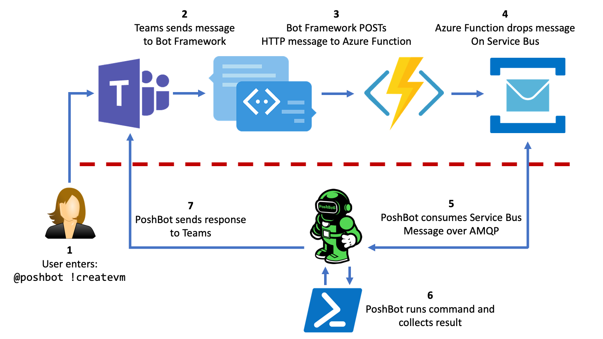
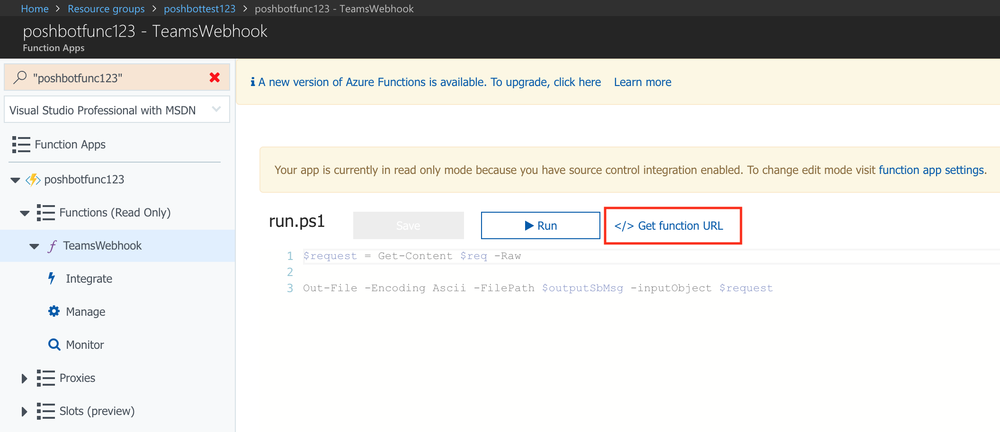
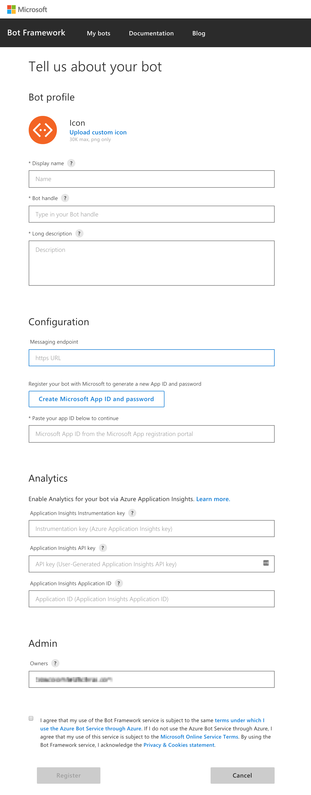

# Setting up Microsoft Teams Backend

Because of the bot architecture in Microsoft Teams, there is a fair amount of work enable PoshBot to work with it.
When sending a message to a bot in Teams, it expects to be able to POST a JSON payload to a HTTPS endpoint.
To avoid having to expose PoshBot on the internet while at the same time giving it access to your internal network for day-to-day ChatOps activities, an alternate method using an Azure Function and Service Bus is used.

Teams will send messages to an Azure Function which will in turn send the message to a Service Bus queue.
PoshBot can then make an outbound call to the queue to consume the messages.
Bot command responses are then send directly to Teams.
This allows PoshBot to be kept inside the firewall.



The steps to create the necessary Azure resources and wire up Teams to PoshBot is outlined below.

## Azure Login

Log in to your Azure subscription using the [Azure CLI](https://docs.microsoft.com/en-us/cli/azure/install-azure-cli?view=azure-cli-latest).
Make sure you have the correct subscription active.

```
az login
az account set --subscription "<SUBSCRIPTION-NAME>"
```

## Create Resource Group

Create a new resource group in your desired region. This group will contain both the Azure Function and Service Bus resources.

```
az group create --name <RESOURCE-GROUP-NAME> --location <REGION>
```

## Service Bus

Create a new Service Bus namespace in the resource group.
The `Basic` SKU is fine for our purposes.

```
az servicebus namespace create --resource-group <RESOURCE-GROUP-NAME> \
  --name <NAMESPACE-NAME> --location <REGION> --sku Basic
```

The new queue should have the following settings:

| Setting | Value |
|---------|-------|
| Message time to live | 1 minute |
| Lock duration        | 30 seconds |
| Maximum delivery count | 10 |
| Maximum Size | 1GB |
| Partitioning | false |
| Move expired messages to dead-letter queue | true |

```
az servicebus queue create --resource-group <RESOURCE-GROUP-NAME> \
  --namespace-name <NAMESPACE-NAME> --name messages --lock-duration "0:00:30" \
  --default-message-time-to-live "0:01:00" --max-delivery-count 10 \
  --max-size 1024 --enable-partitioning false \
  --enable-dead-lettering-on-message-expiration true
```

Create a new `Shared access policy` called `receive` for the `messages` queue with `Listen` permission.

```
az servicebus queue authorization-rule create --resource-group <RESOURCE-GROUP-NAME> \
  --namespace-name <NAMESPACE-NAME> --queue-name messages --name receive --rights Listen
```

Retrieve the SAS key for the `messages` queue.
This key will be needed in the Teams backend configuration for PoshBot so it can connect to the queue and receive messages.

```
$key = az servicebus queue authorization-rule keys list --resource-group <RESOURCE-GROUP-NAME> \
  --namespace-name <NAMESPACE-NAME> --queue-name messages --name receive --query primaryKey --output tsv
```

Retrieve the root connection string for the namespace.
This will be used by the Azure Function so it can drop messages into the queue when POSTs are received from Bot Framework.

```
$rootConnectionString = az servicebus namespace authorization-rule keys list \
  --resource-group <RESOURCE-GROUP-NAME> --namespace-name <NAMESPACE-NAME> \
  --name RootManageSharedAccessKey --query primaryConnectionString --output tsv
```

## Azure Function

Create a new Azure Function in the resource group.
This Azure Function will receive messages from the Bot Framework and drop the message onto the Service Bus queue.

The source code for the Azure Function is contained in the [TeamsWebhook](https://github.com/poshbotio/TeamsWebhook) GitHub repository.

```
az storage account create --resource-group <RESOURCE-GROUP-NAME> --name <STORAGE-ACCOUNT-NAME> \
  --location <REGION> --sku Standard_LRS

az functionapp create --resource-group <RESOURCE-GROUP-NAME> --name <FUNCTION-APP-NAME> \
  --storage-account <STORAGE-ACCOUNT-NAME> --consumption-plan-location <REGION> \
  --deployment-source-url "https://github.com/poshbotio/TeamsWebhook"
```

Create an application setting for the Service Bus connection string.

```
az functionapp config appsettings set --resource-group <RESOURCE-GROUP-NAME> \
  --name <FUNCTION-APP-NAME> --settings "SB_CONNECTION = $rootConnectionString"
```

Disable the git integration

```
az functionapp deployment source config --resource-group <RESOURCE-GROUP-NAME> \
  --name <FUNCTION-APP-NAME> --repo-url "https://github.com/poshbotio/TeamsWebhook" \
  --manual-integration
```

Make note of the function URL.
Unfortunately, the Azure CLI does not have a command to retrieve the function URL or token.
To do that, log into the Azure portal and retrieve it there.




## Create a Bot in Bot Framework

Navigate to the URL below in order to create a new bot in Bot Framework.

[https://dev.botframework.com/bots/new](https://dev.botframework.com/bots/new)

Note that the **bot handle** is globally unique and can not be changed later.
Copy this value down as it will be needed by the Teams backend in PoshBot.

For **Messaging endpoint**, enter the Azure Function URL you created earlier.

> Make sure the URL includes the function token so Bot Framework is making authenticated calls to your function.

Make sure to create a new **App ID** and **password** and record these values.
They will also be need by the Teams backend in PoshBot.



Once the bot has been created, you'll need to add Teams as an available channel.
Select Teams from the list of available channels and accept the Terms of Service.

Once added, you should see both Microsoft Teams and Web Chat as connected channels.


## Test Bot Framework

* Go to Test pane in Bot Framework and send a message.

* Verify Azure Function received message by looking at function logs

* Verify message is submitted to Service Bus queue

## Install App Studio in Teams

## Create a Bot Manifest using App Studio

## Sideload the Bot Manifest in Teams

## Create PoshBot Startup Script

## Start PoshBot

8. Install [App Studio](https://docs.microsoft.com/en-us/microsoftteams/platform/get-started/get-started-app-studio) in Teams

9. Inside App Studio in Teams, go to `Manifest editor` tab and create a new app.
  * Enter values for all required settings
  * Navigate to `Capabilities -> Bots`
    * Enter name for bot and the App ID you created in Bot Framework
    * Make sure `Personal` and `Team` is selected under `Scope`
    * Go to `Finish -> Test and distribute`
      * Export the bot manifest .zip to your computer.

10. Go to Teams -> Manage Team
  * Go to Apps tab and select `Upload a custom app`. Select the manifest .zip you downloaded.

11. Create Poshbot startup script that uses the values you just setup.

### Example PoshBot startup script

```powershell
Import-Module PoshBot
$pbc = New-PoshBotConfiguration
$pbc.BotAdmins = @('<AAD-USER-PRINCIPAL-NAME>')

$backendConfig = @{
    Name                = 'TeamsBackend'
    BotName             = '<BOT-NAME>'
    TeamId              = '<TEAMS-ID>'
    ServiceBusNamespace = '<SERVICE-BUS-NAMESPACE-NAME>'
    QueueName           = 'messages'
    AccessKeyName       = 'receive'
    AccessKey           = '<SAS-KEY>' | ConvertTo-SecureString -AsPlainText -Force
    Credential          = [pscredential]::new(
        '<BOT-APP-ID>',
        ('<BOT-APP-PASSWORD>' | ConvertTo-SecureString -AsPlainText -Force)
    )
}
$backend = New-PoshBotTeamsBackend -Configuration $backendConfig

$bot = New-PoshBotInstance -Configuration $pbc -Backend $backend
$bot | Start-PoshBot -Verbose
```
